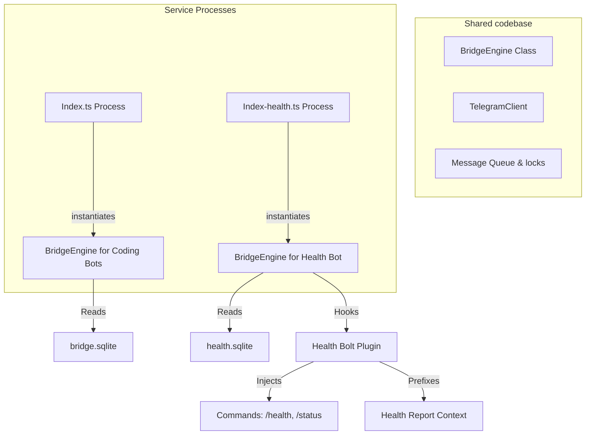

# Research Document: Integrating Health Monitoring into the Telegram Bridge Path

This document evaluates the architectural feasibility, pros and cons, recommended approach, and implementation plan for reusing the main "tried and tested" Telegram interactions path ([index.ts](file:///home/content-crawler/agent-bridge/src/index.ts)) for the health monitoring bot service ([index-health.ts](file:///home/content-crawler/agent-bridge/src/index-health.ts)), while maintaining strict state and token separation.

---

## 1. Background & Context

The Agent Bridge has two separate Telegram bot pathways:
1. **Agent Bots ([index.ts](file:///home/content-crawler/agent-bridge/src/index.ts)):** Manages Codex, Claude, and Antigravity bots. It features robust polling, concurrency locking, message queuing, media buffering, error resilience, rate-limit retries, and `/stop` or `/cancel` hooks.
2. **Health Bot ([index-health.ts](file:///home/content-crawler/agent-bridge/src/index-health.ts)):** A separate background service that monitors system health. It implements its own bare-bones long-polling loop, manual CLI execution, and basic command routing.

While the Health Bot achieves **state isolation** (separate database `.data-health/health.sqlite` and separate Telegram token `TELEGRAM_BOT_TOKEN_HEALTH`), it duplicates message parsing and lacks critical quality-of-life and safety features of the main bot, such as:
- **Concurrency Locks & Queues:** If a user runs multiple commands concurrently or triggers `/health` repeatedly, it spawns multiple concurrent CLI scripts without locking.
- **Process Aborts:** The `/stop` or `/cancel` commands are not captured, meaning a hanging script or agent suggestion run cannot be killed from chat.
- **Progress indicators:** Lacks standard typing progress or "Working..." updates.
- **Buffer & Retry Resilience:** Lacks media group buffering and auto-retries on Telegram 429 rate limits.

---

## 2. Core Question

> **Does it make sense to reuse the "tried and tested" telegram interactions path from [index.ts](file:///home/content-crawler/agent-bridge/src/index.ts) with the health check as a bolt-on, while keeping their runtime states separate?**

**Yes.** Reusing the core Telegram interaction framework is highly recommended to eliminate code duplication and instantly equip the health bot with queuing, locking, error recovery, and process cancellation. However, this must be done in a way that preserves process and configuration isolation to avoid cross-bot interference.

---

## 3. Architectural Options

### Option 1: Completely Unified Service (Single Process)
Run a single Node.js process that boots up all bots (Codex, Claude, Antigravity, and Health). The health bot is registered as a bot kind (`health`) alongside the coding bots.
* **State Isolation:** The `health` bot kind uses its own token and is configured to write to `health.sqlite` while coding bots write to `bridge.sqlite`.
* **Process Isolation:** None. They all share the same Node.js event loop.

### Option 2: Shared Engine, Separate Running Processes (Recommended)
Refactor the core routing, queueing, locking, and execution logic of [BridgeBot](file:///home/content-crawler/agent-bridge/src/index.ts#L119) into a reusable `BridgeEngine` class or library module. 
* The coding bots (`src/index.ts`) and health bot (`src/index-health.ts`) both import and instantiate `BridgeEngine`.
* **State Isolation:** The health bot process passes its own configuration, database connection, and Telegram token to the engine.
* **Process Isolation:** The health bot runs as a separate systemd service (`agent-bridge-health.service`) with its own isolated Node.js event loop and environment context.

### Option 3: Status Quo (Completely Separate Paths - Current State)
Keep the health bot's message-polling loop and CLI execution path entirely isolated from the main codebase.
* **State & Process Isolation:** 100% separate.
* **Shared Code:** None.

---

## 4. Pros & Cons Matrix

| Feature / Dimension | Option 1: Unified Process | Option 2: Shared Engine (Recommended) | Option 3: Status Quo (Current) |
| :--- | :--- | :--- | :--- |
| **Telegram Feature Parity** | ✅ **Full** (Locks, queues, aborts, buffering, retries) | ✅ **Full** (Locks, queues, aborts, buffering, retries) | ❌ **Minimal** (Simple loop, no locks, queueing, or `/stop`) |
| **State & Token Isolation** | ✅ **Isolated** (Separate configs/DBs config-wired) | ✅ **Isolated** (Separate configs/DBs config-wired) | ✅ **Isolated** (Separate configs/DBs config-wired) |
| **Process Isolation** | ❌ **None** (Crash or hang in one bot blocks or stops all bots) | ✅ **High** (Health checks/crons run in independent process) | ✅ **High** (Health checks/crons run in independent process) |
| **Code Duplication** | ✅ **None** | ✅ **None** (Shared module imports) | ❌ **High** (Parallel polling, cli-runner, parser logic) |
| **Maintenance & Complexity** | ⚠️ **Medium** (Single complex process orchestrator) | ⚠️ **Medium** (Requires refactoring core bot into class module) | ❌ **High** (Fixes to polling/locks must be applied to both paths) |

---

## 5. Recommended Architecture: Shared Engine & Process Isolation

We recommend **Option 2: Shared Engine, Separate Running Processes**. 

By extracting the message loop and queueing logic from [index.ts](file:///home/content-crawler/agent-bridge/src/index.ts) into a reusable engine module (e.g., `src/engine.ts`), we can run `agent-bridge-health` as a separate systemd service while still importing the exact same robust interaction code used by Claude and Codex.

### State & Bot Customization via a "Bolt" Hook
To support health-specific behavior (`/health`, `/status`, context injection) without polluting the core engine, the `BridgeEngine` will support a middleware/plugin hook structure:
1. **Command Customizer:** Intercepts incoming messages to route special commands.
2. **Context Injector:** Dynamically injects context (e.g., the last health check report) before calling the CLI.

---

## 6. Implementation Plan

### Phase 1: Engine Extraction
1. Define a `BridgeEngine` class in a new file `src/engine.ts`.
2. Move the polling loop, `handleUpdate`, `handleMessages`, lock checks, `MediaGroupBuffer`, and `runCli`/`runCliAsync` dispatching from [index.ts](file:///home/content-crawler/agent-bridge/src/index.ts) into the `BridgeEngine` class.
3. Configure `BridgeEngine` constructor to accept:
   - `TelegramClient` instance (initialized with the bot token).
   - `BridgeDb` instance (initialized with the respective SQLite database path).
   - Bot configuration options (command, model preference, allowed user IDs).
   - Optional hooks: `onCommand(cmd, context): Promise<CommandResult | null>` and `onBeforeExecute(prompt, context): Promise<string>`.

### Phase 2: Refactoring index.ts
1. Update [index.ts](file:///home/content-crawler/agent-bridge/src/index.ts) to instantiate `BridgeEngine` for the coding bots.
2. Pass standard command routing ([commands.ts](file:///home/content-crawler/agent-bridge/src/commands.ts)) via the `onCommand` hook.
3. Verify all existing tests pass under the new refactored structure.

### Phase 3: Hook API
1. Add `onCommand` and `onBeforeExecute` hooks to `BridgeEngine` (stubs acceptable at this phase if not already wired in Phase 1).
2. Implement concrete handlers in `HealthBridgeBot`:
   - **`onCommand`**: `/health` → run registered health plugins and report; `/status` → call `getStatusText()` and return formatted output.
   - **`onBeforeExecute`**: Call `buildOnDemandPrompt(prompt)` to prepend the latest health report context before any CLI invocation.

### Phase 4: Migration
1. Update [index-health.ts](file:///home/content-crawler/agent-bridge/src/index-health.ts) to instantiate `BridgeEngine` with its specific config:
   - Token: `TELEGRAM_BOT_TOKEN_HEALTH`
   - Database: `health.sqlite`
2. Wire `HealthBridgeBot` hooks into the engine instance.
3. Delete the custom long-polling loop, basic message handler, and manual execution spawning from [index-health.ts](file:///home/content-crawler/agent-bridge/src/index-health.ts).

### Phase 5: Validation (TDD)
1. **Regression tests** — write or update tests covering:
   - `/health` command triggers plugin run and returns a report.
   - `/status` returns `getStatusText()` output without spawning a CLI.
   - `onBeforeExecute` prepends health context to the prompt before execution.
   - Concurrent executions are serialised by the engine lock (no parallel CLI spawns).
   - `/stop` abort cancels an in-flight execution and releases the lock.
   - Engine ignores messages from unauthorised user IDs.
2. **Systemd smoke test** — after deployment, confirm `agent-bridge-health.service` starts cleanly, restarts on failure, and that a `/health` command round-trips successfully over Telegram.

---

## 7. Current Implementation Notes

The health service now follows the shared-engine model:

- `src/index-health.ts` instantiates `BridgeEngine` with `kind: "health"` so the health bot keeps isolated Telegram and SQLite state.
- Health suggestions execute through the configured CLI kind from `HEALTH_SUGGEST_BOT` / `HEALTH_CLI_BOT`, passed as `executionKind`, so Codex, Antigravity, and Claude each use their own invocation, parsing, timeout, and Telegram rendering path.
- Manual `/health` returns one combined report. Individual plugin reports are persisted silently for `/status` context with `HealthBridgeBot.handleReport(..., { force: true, silent: true })`; they are not force-sent as separate Telegram messages.

`HEALTH_SUGGEST_*` is the documented health suggestion configuration family. `HEALTH_CLI_*` remains supported as a compatibility alias for existing deployments.
